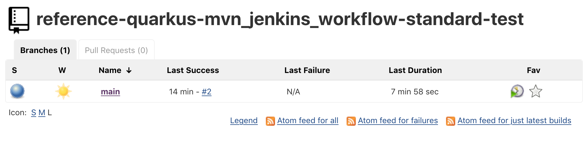

# Overview

In this repo, you will deploy the Ploigos Software Factory on Azure Red Hat OpenShift (ARO) and trigger a Ploigos software pipeline using GitHub Actions.

## Prerequisites

* Azure Red Hat OpenShift 4 cluster
* Admin access to OpenShift
* [OpenShift CLI](https://docs.openshift.com/container-platform/4.6/cli_reference/openshift_cli/getting-started-cli.html)

## Prep

Login to the cluster using `oc login` and admin credentials.

## Setup

1. Fork this [repo](https://github.com/theckang/reference-quarkus-mvn_jenkins_workflow-standard).
2. Follow these [instructions](https://github.com/ploigos/ploigos-software-factory-operator#tssc-demo-with-a-reference-app) to deploy the platform for the Ploigos Software Factory.  Stop after Step #11.  You will deploy your own custom pipeline instance.
3. Modify the `config/pipeline.yaml` resource.  Replace the `sourceUrl` with your repo fork.
4. Deploy the pipeline.

```bash
oc project devsecops    # modify this if you installed Ploigos in a different project
oc create -f config/pipeline.yaml
```

5. The repo has a GitHub action that will mirror your fork repo to the Gitea instance.  You can view the example [here](https://github.com/theckang/reference-quarkus-mvn_jenkins_workflow-standard/blob/main/.github/workflows/mirroring.yaml).  You need to add the Gitea admin's username and password as a secret to your repo.

In GitHub, navigate to your forked repo.  Go to 'Settings' -> 'Secrets'.  Create two repository secrets `GIT_USERNAME` and `GIT_PASSWORD`.  Execute these commands to get the username and password of your Gitea instance and enter these values.

```bash
echo $(oc get secret gitea-admin-credentials -o jsonpath="{.data.username}") | base64 --decode && echo
echo $(oc get secret gitea-admin-credentials -o jsonpath="{.data.password}") | base64 --decode && echo
```

6. In your fork repo, you need to modify the `.github/workflows/mirroring.yaml` resource.

Get the URL of your Gitea repo

```bash
echo $(oc get route gitea --template='http://{{.spec.host}}/platform/reference-quarkus-mvn_jenkins_workflow-standard.git')
```

Open `.github/workflows/mirroring.yaml` with your favorite editor and replace the `REMOTE` with your Gitea instance.

7. Commit this change to your repo

```bash
git clone <your-fork>
cd <your-fork>
git commit -am "Updated Gitea endpoint"
git push
```

8. In GitHub, navigate to your fork.  Go to 'Actions'.  You should see the action:


9. Navigate to your running build job in Jenkins.  Login in `oc` admin credentials.  Wait ~10 minutes until the job is complete.

```bash
echo $(oc get route jenkins --template='http://{{.spec.host}}/job/platform/job/reference-quarkus-mvn_jenkins_workflow-standard/')
```

It should look like this:



10. The Jenkins job built your application.  Navigate to the application in your browser.  

```bash
echo $(oc get route fruit -n platform-ref-quarkus-mvn-jenkins-std-fruit-main-prod --template='http://{{.spec.host}}/fruits.html')
```

You should see:


## Troubleshooting

1.  If you push a commit to the main branch but don't see the Jenkins build trigger, make sure the webhook is configured in Gitea.

Navigate to the Gitea repo in your browser

```bash
echo $(oc get route gitea --template='http://{{.spec.host}}'/platform/reference-quarkus-mvn_jenkins_workflow-standard-github)
```

Login with admin credentials

```bash
echo $(oc get secret gitea-admin-credentials -o jsonpath="{.data.username}") | base64 --decode && echo
echo $(oc get secret gitea-admin-credentials -o jsonpath="{.data.password}") | base64 --decode && echo
```

Navigate to 'Settings' -> 'Webhooks' and you should see:


If you don't see this webhook, navigate to Jenkins in your browser.  Login with `oc` admin credentials.

```bash
echo $(oc get route jenkins --template='http://{{.spec.host}}')
```

In Jenkins, navigate to 'Manage Jenkins' -> 'Configure System' -> 'Gitea Servers'.  You should see a checkbox for 'Manage hooks'.  Select the checkbox if it's not checked and make sure to hit `Save`.


Now navigate to the 'Platform Gitea Org'

```bash
echo $(oc get route jenkins --template='http://{{.spec.host}}/job/platform')
```

On the left, hit 'Scan Gitea Organization Now'.  This will configure a webhook in Gitea for you.

## Resources

* [Ploigos Operator](https://github.com/ploigos/ploigos-software-factory-operator)
* [Reference Application](http://gitea.tssc.rht-set.com/akrohg/reference-quarkus-mvn_jenkins_workflow-standard.git)
* [Setting up webhook in Gitea/Jekins](https://gcube.wiki.gcube-system.org/gcube/Gitea/Jenkins:_Setting_up_Webhooks)
